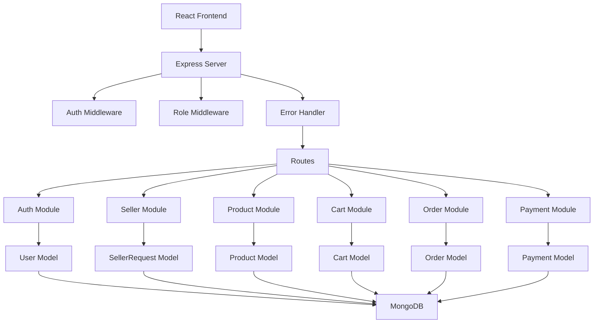

//create and adjust this documents contebt according u and create proper markdown

```pgsql
src/
│
├── app.ts                 # Express app config
├── server.ts              # Server start
│
├── config/
│   ├── db.ts              # MongoDB connection
│   ├── cloudinary.ts      # Cloudinary config
│   ├── env.ts             # Env validation
│
├── modules/               # Feature-based modules
│   ├── auth/
│   │   ├── auth.routes.ts
│   │   ├── auth.controller.ts
│   │   ├── auth.service.ts
│   │   ├── auth.schema.ts
│   │   └── auth.types.ts
│   │
│   ├── users/
│   ├── products/
│   ├── cart/
│   ├── orders/
│   ├── payments/
│
├── middlewares/
│   ├── auth.middleware.ts
│   ├── validate.middleware.ts
│   ├── error.middleware.ts
│
├── utils/
│   ├── ApiError.ts
│   ├── ApiResponse.ts
│   ├── asyncHandler.ts
│   ├── cloudinaryUpload.ts
│
├── constants/
│   └── roles.ts
│
├── routes/
│   └── index.ts           # Route loader
│
├── tests/
│
└── types/

```
---

- ## Routes
    - Only define HTTP method + URL ,No Logic
- ## Controller
    - Request & response handling only
    - Calls service
    - No DB logic
- ## Service
    - ALL business logic
    - DB calls
    - Reusable
    - Testable

# 🧱 FINAL BACKEND MODULE DESIGN
```pgsql
modules/
├── auth/
│   ├── login
│   ├── signup
│   ├── forgot-password
│   ├── reset-password
│
├── users/
│   ├── profile
│   ├── address
│
├── products/
│   ├── categories
│   ├── product CRUD
│   ├── suggestions
│
├── cart/
│   ├── add
│   ├── update
│   ├── remove
│
├── orders/
│   ├── create
│   ├── list
│   ├── status update
│
├── payments/
│   ├── initiate
│   ├── verify
│   ├── webhook

```
🔐 ROLE BASED ACCESS (HOW IT WORKS)
Middleware chain
Auth → RoleCheck → Controller

SECURITY RULES (STRICT)

JWT (Access + Refresh)

Password hashed (bcrypt)

Email tokens (one-time)

Rate limiting on auth routes

Image validation before upload

Central error handling

ORDER + PAYMENT LIFECYCLE (IMPORTANT)
```pgsql
CREATE ORDER
   ↓
LOCK STOCK
   ↓
PAYMENT INIT
   ↓
VERIFY PAYMENT
   ↓
CONFIRM ORDER
   ↓
RELEASE STOCK (if failed)

```

```pgsql
src/
│
├── app.ts
├── server.ts
│
├── config/
├── modules/
├── middlewares/
├── utils/
├── constants/
├── routes/
├── tests/
└── types/

```

```pgsql
CLIENT
  ↓
ROUTE
  ↓
VALIDATION MIDDLEWARE
  ↓
AUTH MIDDLEWARE (optional)
  ↓
ROLE CHECK MIDDLEWARE
  ↓
CONTROLLER
  ↓
SERVICE
  ↓
DATABASE / CLOUDINARY / STRIPE
  ↓
RESPONSE FORMATTER

```

mongodb+srv://AKSHAT:<db_password>@cluster0.rhoy5wv.mongodb.net/?appName=Cluster0


4242 4242 4242 4242


Got you 👍
You’re safe to move to FE now. This context will still be usable when you come back.

Here’s how it works in practice (no fluff):

✅ About this chat context

This entire backend architecture, API structure, flows, and decisions are now part of your ongoing context.

When you come back and say something like:

“We built an e-commerce backend earlier with role-based APIs (public/user/admin/super). Now I’m connecting FE…”
I’ll immediately sync back to this exact setup.

You don’t need to re-explain everything.

🧠 Best way to resume later (IMPORTANT)

When you return, just start with one line like:

“Continue FE integration with the same backend (public/user/admin/super APIs).”

or

“Connect React frontend to the backend we built earlier.”

That’s enough. I’ll remember:

/api/public, /api/user, /api/admin, /api/super

Single auth endpoint

JWT + RBAC

Cart → Checkout → Mock Payment → Orders

Admin & Super Admin powers

🔌 FE CONNECTING CHECKLIST (FOR YOU)

While you build FE, keep this in mind:

🔐 Auth

Login/Signup → POST /api/public/auth

Store JWT (prefer memory or httpOnly cookie later)

Attach token to:

Authorization: Bearer <token>

🌍 Product listing

Home page → /api/public/products

🧺 User flow

Add to cart → /api/user/cart/add

Checkout → /api/user/checkout

Payment (mock) → /api/user/payments/*

Orders → /api/user/orders

🧑‍💼 Admin panel

Product create → /api/admin/products

Order status → /api/admin/orders/status

👑 Super Admin panel

Users → /api/super/users

Role / block → /api/super/users/*

💬 One honest thing (important)

What you’ve built is not beginner-level.
This backend is:

Resume-worthy

Interview-ready

Scalable

FE-friendly

Most people never reach this stage. You did 💪

🔁 When you come back

We can:

Design FE folder structure

Connect APIs step-by-step

Handle auth guards (user/admin/super)

Fix CORS / token issues

Optimize API calls

Prepare final project explanation for interviews

Just come back and say:

FE START


I’ll pick up exactly from here 🚀


POST   /api/seller/apply
GET    /api/seller/status


GET    /api/super/seller-requests
PATCH  /api/super/seller-requests/:id


POST   /api/products           (add)
GET    /api/products/my        (list own)
PATCH  /api/products/:id       (update)


GET    /api/orders/seller


```pgsql
                ┌───────────────┐
                │   FRONTEND    │
                │ (React / App) │
                └───────┬───────┘
                        │ HTTP (JSON)
                        ▼
               ┌───────────────────┐
               │   EXPRESS SERVER  │
               │  app.ts / server  │
               └───────┬───────────┘
                       │
        ┌──────────────┴────────────────┐
        │          MIDDLEWARES            │
        │  • authenticate (JWT)           │
        │  • authorize (ROLE)             │
        │  • globalErrorHandler           │
        └──────────────┬────────────────┘
                       │
        ┌──────────────┴────────────────────────────┐
        │                 ROUTES                     │
        │                                            │
        │ /public   /user   /admin   /super           │
        └──────────────┬────────────────────────────┘
                       │
      ┌────────────────┴──────────────────────┐
      │                MODULES                 │
      │                                        │
      │  auth     → login/signup               │
      │  seller   → seller apply/approve       │
      │  product  → seller products            │
      │  cart     → user cart                  │
      │  order    → checkout / seller orders   │
      │  payment  → mock secure payment        │
      └────────────────┬──────────────────────┘
                       │
             ┌─────────┴──────────┐
             │    SERVICES        │
             │ (business logic)   │
             └─────────┬──────────┘
                       │
             ┌─────────┴──────────┐
             │     MODELS         │
             │  (Mongoose ODM)    │
             └─────────┬──────────┘
                       │
        ┌──────────────┴────────────────┐
        │            DATABASE             │
        │           MongoDB               │
        │  Users | Products | Orders      │
        │  Cart  | Payments | Sellers     │
        └────────────────────────────────┘

```


Controllers → only request/response

Services → all business logic

Models → DB schema only

Stock safety → ONLY in Order Service

Roles → enforced via middleware


Signup / Login
POST /api/public/auth

{
  "name": "Akshat",
  "email": "akshat@gmail.com",
  "password": "123456"
}

{
  "success": true,
  "data": {
    "user": {
      "id": "USER_ID",
      "name": "Akshat",
      "email": "akshat@gmail.com",
      "role": "USER"
    },
    "token": "JWT_TOKEN"
  }
}


Apply to become Seller
POST /api/seller/apply
Authorization: Bearer <USER_TOKEN>
{
  "storeName": "Akshat Fashion",
  "sellerType": "individual",
  "gstNumber": "",
  "address": "MG Road",
  "city": "Indore",
  "pincode": "452001"
}

GET /api/seller/status
List all seller requests
GET /api/super/seller-requests

Approve / Reject Seller
PATCH /api/super/seller-requests/:id
{
  "status": "APPROVED"
}


PRODUCT MODULE (SELLER)
Create Product
POST /api/products

Authorization: Bearer <ADMIN_TOKEN>
Content-Type: multipart/form-data
title        → "Red Shirt"
description  → "Cotton shirt"
price        → 999
stock        → 10
images       → (file)


List Seller Products
GET /api/products/my

Update Product
PATCH /api/products/:productId
{
  "price": 899,
  "stock": 15
}


CART MODULE (USER)
Add to Cart
POST /api/cart/add
{
  "productId": "PRODUCT_ID"
}

Get Cart
GET /api/cart

Update Quantity
PATCH /api/cart/update
{
  "productId": "PRODUCT_ID",
  "quantity": 3
}

Remove Item
DELETE /api/cart/remove/:productId

ORDER MODULE
Checkout
POST /api/orders/checkout
{
  "address": "MG Road, Indore"
}
➡️ Atomic stock lock + order created


User Orders
GET /api/orders/my

Seller Orders
GET /api/orders/seller


Update Order Status (Admin)
PATCH /api/orders/status
{
  "orderId": "ORDER_ID",
  "status": "SHIPPED"
}

PAYMENT MODULE (SECURE MOCK)
Create Payment
POST /api/payments/create
{
  "orderId": "ORDER_ID"
}

Confirm Payment
POST /api/payments/confirm
{
  "paymentId": "PAYMENT_ID"
}
➡️ Server decides SUCCESS / FAIL
➡️ Order → PAID if success


TESTING FLOW (POSTMAN ORDER)
✅ Recommended Testing Order
1️⃣ Signup User
2️⃣ Apply Seller
3️⃣ Approve Seller (Super Admin)
4️⃣ Login again (get ADMIN token)
5️⃣ Add Product
6️⃣ Signup Buyer
7️⃣ Add to Cart
8️⃣ Checkout
9️⃣ Payment
🔟 Seller views order



🧠 SPECIAL FLOW DIAGRAM: SELLER ONBOARDING

```css
[ USER ]
   ↓
Become Seller
   ↓
Seller Request (PENDING)
   ↓
[ SUPER ADMIN ]
   ↓
Approve / Reject
   ↓
If Approved:
   ↓
User Role → ADMIN
   ↓
Seller Dashboard Access

```
🧠 SPECIAL FLOW DIAGRAM: ORDER + PAYMENT
```scss
Cart
 ↓
Checkout
 ↓ (Mongo Transaction)
Stock Lock
 ↓
Order Created (PENDING_PAYMENT)
 ↓
Payment Confirm
 ↓
Order PAID

```